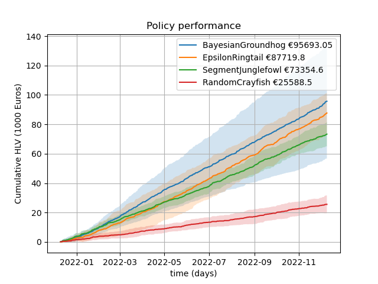

# A marketing campaign management policy simulator.
This application simulates the implementation of candidate Policies in a Telecommunications company.
The application allows multiple policies to run in parallel over the same customer base to provide the likely 
cumulative delta customer lifetime value per policy



# Current policies
The current policies implemented are examples of popular algorithms applied to Multi-Arms Bandit problems. 
This is my no means an exhaustive list, and the implemented policies are not the standard methode you would find on [Wikipedia](https://en.wikipedia.org/wiki/Multi-armed_bandit). 
Typical implementations you can find online focus on optimizing conversion rate. 
The implementations here focus on optimizing Delta Customer Lifetime Value
## EpsilonRingtail
This is a policy based on the Epsilon greedy methode.
This implementation optimize for maximum average customer lifetime value instead of minimizing regret.


## BayesianGroundhog
This is a policy based on Thomson sampling from a Beta distribution of product convert rates.
And the sampled conversion rate is then multiples by the average reward to get the expected customer lifetime value of the action.
The algorithm then chooses the action with the maximum expected customer lifetime value.


## RandomCrayfish
This is simply a reference policy that pick a random action.


# Installation
Clone the repository to a local directory

Change the current working directory to in the folder where created when the repository was cloned

Then create a virtual environment
```bash
python -m venv venv
```
Then activate the environment
```bash
source venv\bin\activate
```
Install all the necessary packages
```bash
pip install -r requierments.txt
```

# Running the application
```bash
python simulator.py
```

# Running the dashboard
```bash
streamlit run app.py
```


# Making your own Policy
First create a new package folder in the root of the repository. 
Try and give it a cool name, see https://pypi.org/project/coolname/ to see how to generate one.

Now copy the \_\_init\_\_.py file from the randomCrayfish folder into you new folder as a starting point.
This is where you can implement your policy.
Take a look at the methods you can implement in the "Policy" class in the  "policy.py" file.

You can test your new package(policy) by adding it to the "policies" list in the "simulator.py" file. 
This is the line right after the
```python
if __name__ == "__main__":
```

## Class diagram

