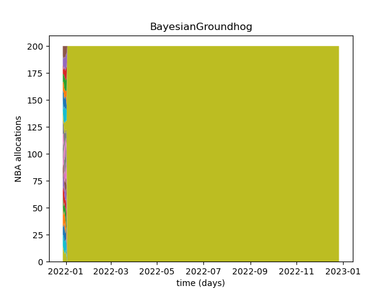
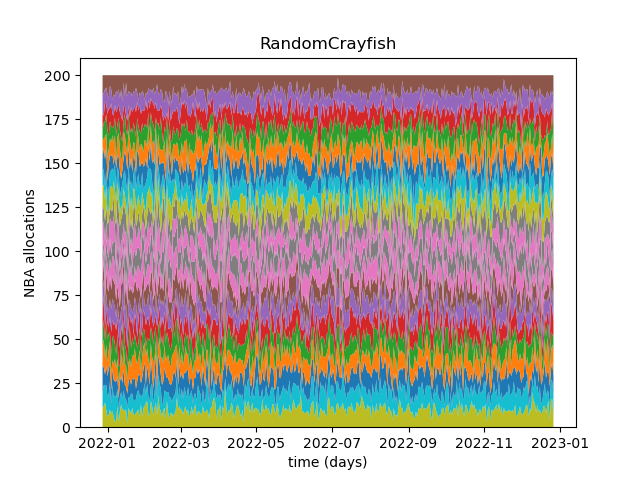
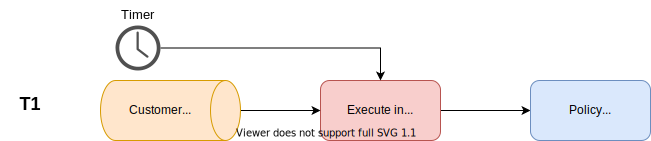

# A marketing campaign management policy simulator.
This application simulates the implementation of candidate Policies in a Telecommunications company.
The application allows multiple policies to run in parallel over the same customer base to provide the likely 
cumulative delta customer lifetime value per policy.


You can experiment with this simulator using the 
[public streamlit app](https://share.streamlit.io/chrismolanus/mab_simulator/app.py)

# Current policies
The current policies implemented are examples of popular algorithms applied to Multi-Arms Bandit problems. 
This is my no means an exhaustive list, and the implemented policies are not the standard methode you would find on 
[Wikipedia](https://en.wikipedia.org/wiki/Multi-armed_bandit). 
Typical implementations you can find online focus on optimizing conversion rate or minimizing regret. 
The implementations here focus on optimizing Delta Customer Lifetime Value 
since this is easier to explain to a marketeer. Delta Customer Lifetime Value would be the difference in the customer's 
Lifetime-Value before and after the marketing action has had its effect. 
But since we are dealing with a telecommunications company here we have to consider that a customer(person) 
can be living in a household that can have only one internet connection. 
So the value of that contract is shared across the members o that household. 
This is why here we usually refer to the Household Lifetime Value(HLV). This business model is mentioned in the PhD Thesis 
of Jan Markendahl 
[Mobile Network Operators and Cooperation](https://www.impgroup.org/uploads/dissertations/dissertion_53.pdf) 
and is widely used by telecommunications companies. A more recent article published by Rebecca Scully 
[How a Modern Approach to Householding Unlocks Better Segments & Campaign Optimization](https://amperity.com/blog/how-a-modern-approach-to-householding-unlocks-better-segments-campaign-optimization)
explains it a bit more. I have never used their services, I just like the way the post explains HLV.

The current implemented policies are also only Non-Contextual Bandits. 
This means they do not take the customer or product data into account. The only exception to this is the 
"SegmentJunglefowl" policy that was implemented to represent how humans do it now, and we(humans) are usually contextual.

## SegmentJunglefowl
This is an implementation that simulates the standard Marketing VIP Gold Silver Bronze segmentation. For simplicity, 
we only implemented a three tier marketing segmentation.


It is intended to be seen as reference for how a marketing department might work 
if the customer segments and actions where mapped by hand.


The policy does a pretty good job at reproducing the type of decisions we typically see in Telco marketing departments.
We typically see a couple large campaigns(actions) that run for a long time,
and a few smaller campaigns with smaller segments.

## EpsilonRingtail
This is a policy based on the Epsilon greedy methode, which take a Semi-Uniform strategy. 
Meaning the most profitable campaign(action) for this customer is allocated to the customer(Exploit) 
the majority of the time, and a random campaign(Explorer) the rest of the time.


This implementation optimize for maximum average customer lifetime value(profit) instead of minimizing "regret" 
that is use in more academic implementations. This choice was to make it easier for marketeers 
to understand the reasoning. Taking a random campaign every so now 
and then attempts to give what may seem like sub-optimal campaigns at the time a chance.


Because the policy tends to pick only one campaign(action) as the exploit action 
and allocates it to customers "Epsilon" percent of the time, we see that the policy may swap between two actions 
that have a close reward value and pretty much ignore the rest. This policy is usually best suited for companies 
that tend to run short campaigns because the market they are in requires them to change often. 
One of the problems that may occur with this policy is that if by chance an action got a string of good reward 
in the beginning, the policy then starting using it as the Exploit while it might not be a global optimum. 
Because this action is taken most of the time it will result in the other actions not getting enough samples 
to demonstrate they are better, and the policy will get stuck in a local minimum for too long. However, 
if the company mainly runs shorter campaigns a policy like this can quickly find "an" optimum 
instead of exploring too much which results in lower revenues.

## BayesianGroundhog
This is a policy based on Thomson sampling from a Beta distribution of product convert rates.
The sampled conversion rate is then multiples by the average customer lifetime value(reward)
to get the Expected-HLV of the campaign(action).
This is a complicated way of saying that we modeled the Expected-HLV of a campaign 
as a Beta distribution. With very little win/loss samples the distribution is wide, uncertain what the Expected HLV is. 
The algorithm then samples from this Expected-HLV distributions(one Distribution per campaign) when it is trying to 
determine the best campaign to assign to the customer. Because we are sampling from a distribution the Expected HLV 
is always a slightly different value(within the beta distribution) but of course more often around the mean. 
This is where the variability of "The Best Campaign" comes from. 
When we have enough win/loss data from a campaign the beta distribution becomes very narrow and therefore more certain 
what the Expected-HLV of the campaign is. 


Now the point is not to discover what the true Expected HLV of the campaigns are 
but to optimize returns(Euros) as soon as possible.
This is why the algorithm then chooses the action with the maximum Expected-HLV from the samples for that customer. 
This is where campaigns that have a narrower distribution will more often return the highest value, 
and the distribution that have the highest mean will more often be chosen to be the winner(maximum Expected-HLV).



This policy may take longer than the Epsilon Greedy policy to decide on an optimum 
but typically has a better chance of finding a global optimum. For this reason it performers better in companies that can
have long-running campaigns since ones it finds the optimum it can maximize revenue by using it. 
It is less likely than the Epsilon Greedy policy to get stuck in a local optimum 
so over the long term will produce higher revenues.

## RandomCrayfish
This is simply a reference policy that pick a random action. This should be the worst possible policy.




# Installation
Clone the repository to a local directory

Change the current working directory to in the folder where created when the repository was cloned

Then create a virtual environment
```bash
python -m venv venv
```
Then activate the environment
```bash
source venv\bin\activate
```
Install all the necessary packages
```bash
pip install -r requierments.txt
```

# Running the application
```bash
python simulator.py
```

# Running the dashboard
```bash
streamlit run app.py
```


Or you can try it out  here: [Hosted App](https://share.streamlit.io/chrismolanus/mab_simulator/app.py)

# Making your own Policy
First create a new package folder in the root of the repository. 
Try and give it a cool name, see https://pypi.org/project/coolname/ to see how to generate one.

Now copy the \_\_init\_\_.py file from the randomCrayfish folder into you new folder as a starting point.
This is where you can implement your policy.
Take a look at the methods you can implement in the "Policy" class in the  "policy.py" file.

The policy is designed to function as a (near)real-time transformer. This means that it is expected 
to be capable for producing an NBA at any moment.


Customer events such as a call to the service desk, or a visit to the website trigger an evaluation for 
a new Next Best Action(NBA). For simplicity, we consider the business ruling that limits the possible things 
we are allowed to do with this customer (Actions) as Out-Of-Scope. These business rules could be 
for example: 
- We can not sell a 1 Gigabit Internet connection to the customer 
because the cable going to their house can never provide that bandwidth.
- We can only sell an upgrade connection to the customer and not a second line 
  since their address can not have a second line installed

Handling changes to these rules are considered out of scope, here we are only concerned with 
learning from past actions to better suggest new NBAs. To accomplish this your policy must implement its own 
calibration(or training) cycle. The choice of how often to recalibrate is up to you. 
This could be:
- Once we have more than 100 new samples (of action rewards)
- Once a day
- On every new sample that we get since we get them in real-time one by one.

There is no computational limit set here, so the only consideration is 
to decide when and how often you should update your belief (model). 
Here it is important to note that when a new action is introduced it is not known if it is a bad one or a good one, 
whether it will have a high reward, or a negative reward. 
So the longer we wait to evaluate the action's probability of producing a positive reward 
the more your policy may prescribe it as an NBA that can result in larger losses if it is a bad one. 
The Action doesn't even have to produce a negative reward on average to be a bad NBA, 
it just has to be worse that any other action that you could have prescribed 
that might have had more of a chance of producing a higher reward. This is what is called regret, the difference between
the average reward of an action, and the estimated average reward of the best performing action 
that could have been prescribed to this customer at teh time.

Once your policy provides an NBA for the customer it is places on a queue 
for it to be executed by the channel associated with the Action.
Note that the action is not performed immediately, in the case of an outbound call for example 
it can be hours before this cll can be made by an agent.



Once the action has been taken, a flag is set in the customer's profile that the action has been take and no other actions should be taken until ether:
- The customer performs an action
- The cool off period has pasted, and the action is presumed to have had no effect.

Both these scenarios produce a (pseudo) customer action. If the customer actually did something we can measure
it is simple, the event is what ever the customer did or at least the data that we measured. 
If the customer did nothing, and the cool off period has pasted 
the company generated a "NULL action" indicating that the company has given up on waiting to see 
if the action will have an effect. 


Each Action has its own cool-off period length based on the marketeers estimates, 
The length of the cool-off period is also considered out of scope here. These reward events can be used 
by your policy to calibrate the presumed effect for the NBA that was previously performed on the customer.


You can test your new package(policy) by adding it to the "policies" list in the "simulator.py" file. 
This is the line right after the
```python
if __name__ == "__main__":
```

## Class diagram

